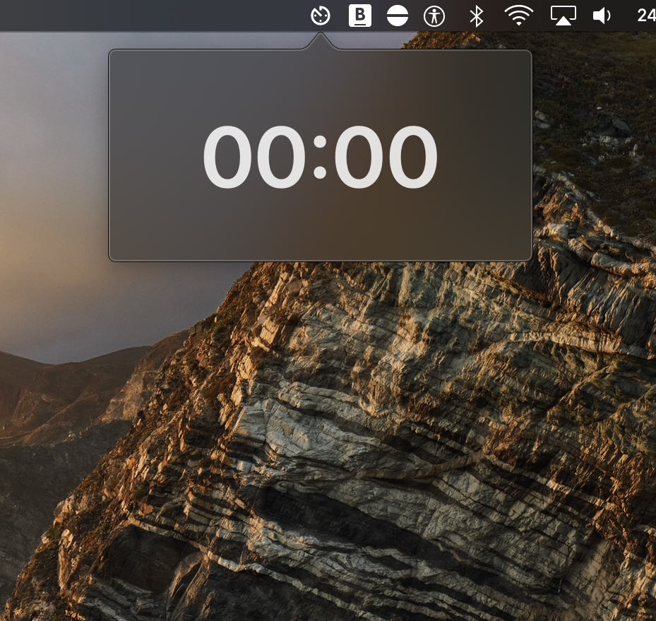

# chrono
A simple macOS application with a countdown timer that lives in the top bar.

The idea was to have an countdown timer which helps me manage coding sessions and extend attention spans. The app behaves like a tradtional stopwatch, but can be accessed from full-screen applications without swiping to the desktop. 

## Instructions:
1. Single click (tap) on the timer to start and stop
2. Double click on the timer to reset

## Screenshot 

### Inspiration

I saw a TikTok video of a student using her iPad as a stopwatch to record a coding sprint. This made do the same, the only problem being that I don't own an iPad. I wondered if I could make an app which sticks to corner of the screen and just shows a timer while I code. To my knowledge, macOS doesn't allow overlay apps in fullscreen mode. Thus, a work around (compromise) was a menu-based app which shows a simple timer.

### Future work:

+ Start/Pause & Reset buttons
+ Vertical stack to keep track (code already exists)
+ Custom countdown timer 
+ Haptic feedback when a session completes
